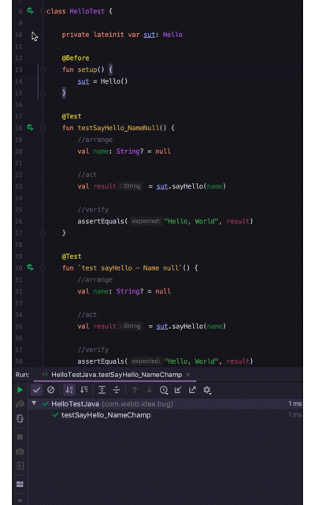
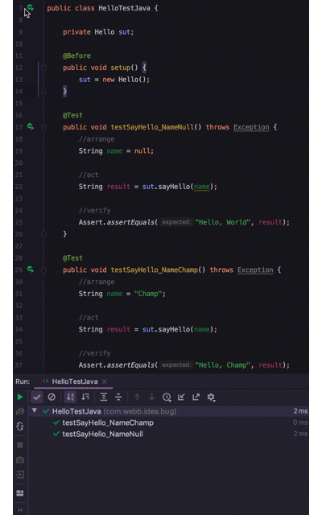

## Demo Project to show IntelliJ IDEA Bug

[Bug Report](https://youtrack.jetbrains.com/issue/IDEA-225554)

For Kotlin test classes, when running a single test from the gutter icon, all of the tests run. For Java test classes, just the singe test runs, which is the expected behavior.

#### Kotlin

#### Java

